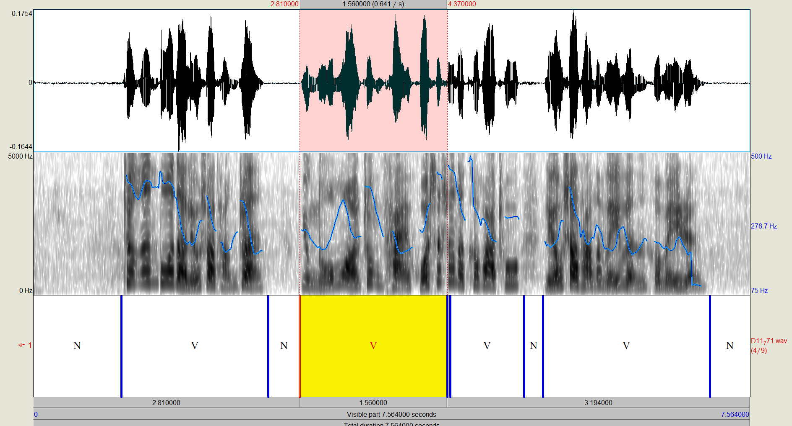

# Simple NN based VAD

Simple DNN based VAD tools

## Usage

``` sh 
vad.sh models/2.wav 
```
The above cmd generate speech segment, just like

```
models/2.wav [ 661 720 ]  [ 880 942 ]  [ 1079 1146 ]
```


If you want to see the details with Praat, the follwing cmd
will generate the TextGrid with N for none-speech and S for speech respectively.

``` sh 
vad.sh models/2.wav | python tools/gen_textgrid
```

### Praat view



### TextGrid

```
File type = "ooTextFile"
Object class = "TextGrid"
xmin = 0
xmax = 7.564000
tiers? <exists>
size = 1
item []:
	 item [1]:
		class = "IntervalTier"
		name = "D11_771.wav"
		xmin = 0
		xmax = 7.564000
		intervals: size = 7 
		intervals [1]:
			xmin = 0.000000
			xmax = 0.950000
			text = "N"
		intervals [2]:
			xmin = 0.950000
			xmax = 2.530000
			text = "V"
		intervals [3]:
			xmin = 2.530000
			xmax = 2.830000
			text = "N"
		intervals [4]:
			xmin = 2.830000
			xmax = 5.230000
			text = "V"
		intervals [5]:
			xmin = 5.230000
			xmax = 5.400000
			text = "N"
		intervals [6]:
			xmin = 5.400000
			xmax = 7.190000
			text = "V"
		intervals [7]:
			xmin = 7.190000
			xmax = 7.564000
			text = "N"
```

